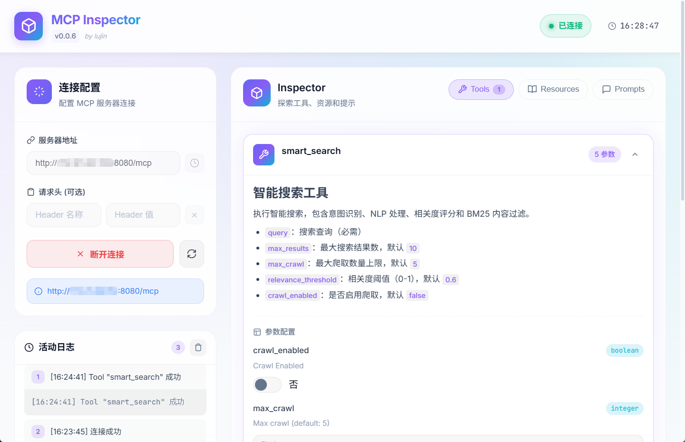
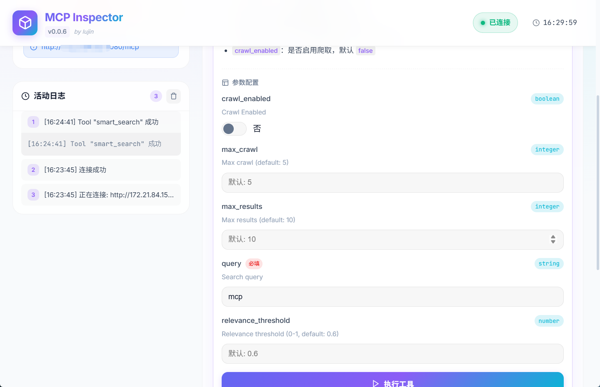
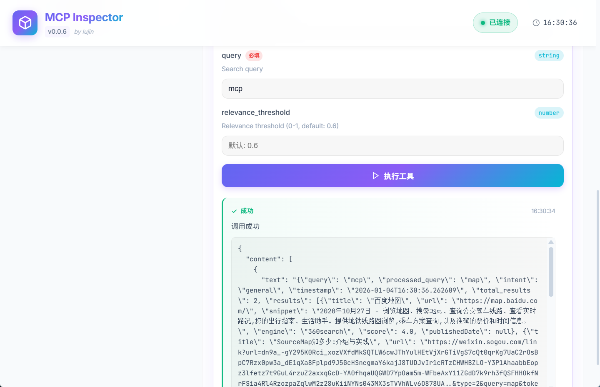

# MCP Inspector


**MCP Inspector** 是基于 **Tauri 2 + Vue 3** 重构的 MCP (Model Context Protocol) 调试工具。前端通过 Vue 3 构建响应式界面，后端利用 Rust (Tauri) 与 `rmcp` 客户端实现高效稳定的协议交互。

---

## ✨ 核心特性

- **🔌 连接管控**
  - 支持自定义服务器 URL（默认 `http://localhost:8080/mcp`）与请求头。
  - **历史记录**：自动保存最近的连接配置，支持一键回填，提升调试效率。
  - **状态实时同步**：顶部状态栏实时反馈连接健康状况。

- **🛠️ 工具调试**
  - **动态表单**：基于 `input_schema` 自动生成校验表单，拒绝手动构造 JSON 的繁琐。
  - **Markdown 渲染**：工具描述与长文本结果支持 Markdown 优美展示。
  - **结果内嵌**：执行结果直接在卡片内展示，无需跳转，反馈链路更短。

- **📦 资源与提示**
  - 提供 **Resources** 与 **Prompts** 的独立视图，支持快速查阅与检索。

- **🎨 视觉体验**
  - **单一亮色主题**：精心调优的清爽亮色界面（Light Mode Only），彻底解决 Windows 下 WebView2 滚动条渲染伪影问题。
  - **侧边栏布局**：左侧统一管理连接与日志，右侧专注内容探索，大屏（1920px）适配更佳。

## 📸 界面预览

<div style="display: grid; grid-template-columns: repeat(3, 1fr); gap: 10px;">
  
  
  
</div>


## 📂 目录结构

| 目录 | 说明 |
| :--- | :--- |
| `frontend/` | **Vue 3 + Vite** SPA 前端。负责 UI 渲染，通过 `@tauri-apps/api` 调用后端命令。 |
| `src-tauri/` | **Tauri 2 Rust** 后端。封装 MCP 通信逻辑，桥接前端与 `rmcp` 客户端。 |
| `Cargo.toml` | 工作区配置，仅包含 backend crate。 |

## 🚀 快速上手

### 1. 环境准备

- **Node.js** (推荐 LTS) + npm/yarn/pnpm
- **Rust Toolchain** (Stable)
- **Tauri CLI**: `cargo install tauri-cli`
- **Linux 依赖** (仅 Linux): `sudo apt install libwebkit2gtk-4.1-dev`

### 2. 开发模式

```bash
cd frontend
npm install
npm run tauri
```

> 此命令将启动 Vite 开发服务器 (localhost:5173) 并自动打开 Tauri 桌面窗口，支持热更新。

### 3. 构建发布

```bash
cd frontend
npm run build
cd ../src-tauri
cargo tauri build
```

> 构建产物位于 `src-tauri/target/release/bundle`。

## 📝 更新日志 (v0.0.7)

本次更新主要集中在**体验优化**与**稳定性修复**：

- **✨ 新增**：连接配置历史记录功能 (History Dropdown)。
- **🏗️ 调整**：默认服务器端口调整为 `8080`。
- **🎨 优化**：移除多主题切换，锁定为**亮色主题**以修复 Windows 渲染问题。
- **🐛 修复**：
    - 工具描述 Markdown 溢出导致窗口撑大。
    - 启动时偶发的白屏问题 (Missing import)。
    - Windows 下 `reqwest` 连接稳定性优化。

## 🔧 后端命令 (Tauri Commands)

Rust 端暴露了以下命令供前端透传调用：

- `connect_mcp(url, headers)`: 建立 MCP 连接。
- `list_tools()`: 获取工具列表。
- `list_resources()`: 获取资源列表。
- `list_prompts()`: 获取提示列表。
- `call_tool(name, args)`: 执行工具调用 (参数需符合 Schema)。


---

> **Note**: 本项目旨在提供一个轻量、现代化的 MCP 协议调试环境。欢迎提交 Issue 或 PR！

## 📄 License

本项目基于 [MIT License](./LICENSE) 开源。
